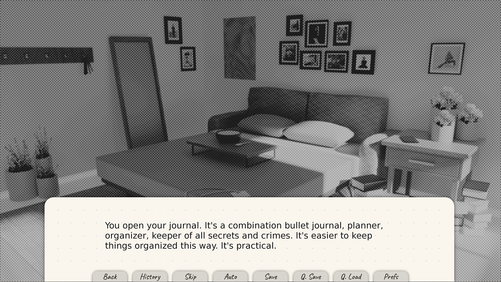
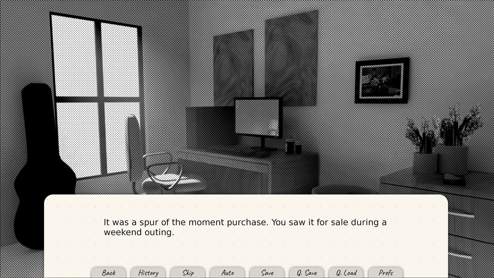
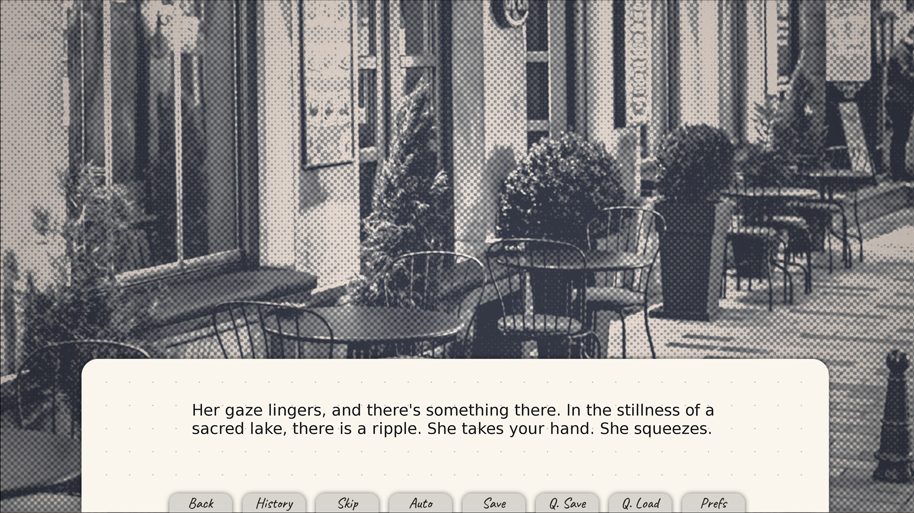
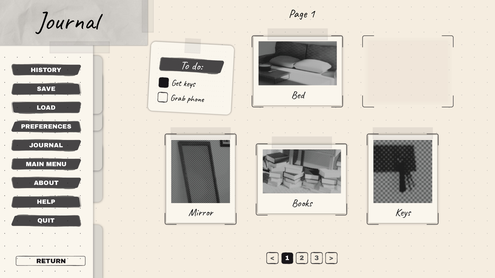

# i want to be dyed in your sound.

Kanade Sato is a [age omitted for her pride] graduate from a prestigious law school. She lives at home with her parents and works as a manager for an up-and-coming girl band named Setsugekka. It’s a nepotism baby’s pet project, each girl scouted specifically to make the bassist look like a respectable human being. Hisae Shimozaki is the salt of the earth, but whatever. Help Kanade get to work on time in this point-and-click visual novel. 

**Content: one-sided romance, childhood friends, 15+, all audiences**

## Screenshots

